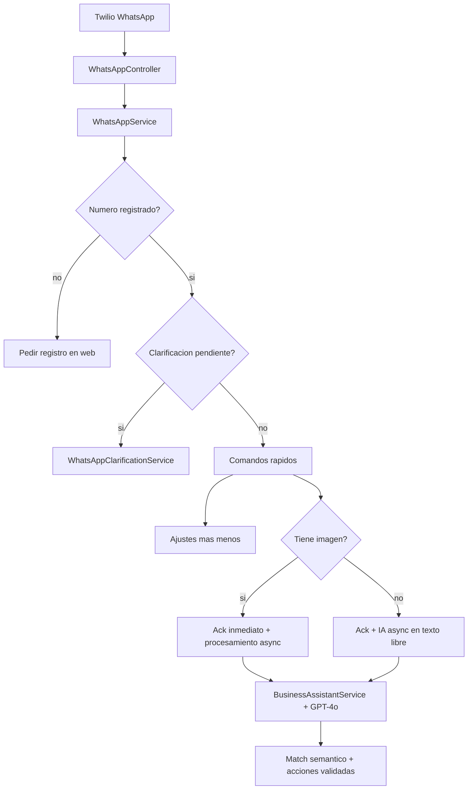

# SmartInventory — Funcionalidades de la aplicación

> **Proyecto:** smartHomeShopper / SmartInventory B2B  
> **Tipo de documento:** Guía funcional (qué **sí** y qué **no** puede hacer la aplicación)  
> **Audiencia:** Usuarios finales, operadores de bodega, administradores de org y equipo técnico  
> **Complementa (no reemplaza):** [DOCUMENTACION_BACKEND.md](../../docs/DOCUMENTACION_BACKEND.md), [DOCUMENTACION_CONTROLLERS.md](DOCUMENTACION_CONTROLLERS.md), [DOCUMENTACION_FRONTEND.md](../../docs/DOCUMENTACION_FRONTEND.md)

---

## Índice

1. [Resumen](#1-resumen)
2. [Roles y permisos](#2-roles-y-permisos)
3. [Aplicación web — qué SÍ puede hacer](#3-aplicación-web--qué-sí-puede-hacer)
4. [Aplicación web — qué NO puede hacer](#4-aplicación-web--qué-no-puede-hacer)
5. [WhatsApp e inteligencia artificial](#5-whatsapp-e-inteligencia-artificial)
6. [Límites transversales](#6-límites-transversales)
7. [Configuración requerida por funcionalidad](#7-configuración-requerida-por-funcionalidad)
8. [Ejemplos por tipo de usuario](#8-ejemplos-por-tipo-de-usuario)
9. [Solución de problemas frecuentes](#9-solución-de-problemas-frecuentes)
10. [Referencias](#10-referencias)

---

## 1. Resumen

**SmartInventory** es una plataforma de **inventario B2B multi-tenant**:

- Cada **organización** (empresa) tiene su catálogo, stock, compras, proveedores y reportes **aislados** del resto.
- Cada **usuario** pertenece a **una organización** (salvo el administrador de plataforma).
- Se accede por **aplicación web** (React) y, opcionalmente, por **WhatsApp** con asistente de IA (Azure AI Foundry + Twilio).

**Canales:**

| Canal | Uso principal |
|-------|----------------|
| Web | Gestión completa: CRUD, reportes, equipo, importación |
| WhatsApp | Consultas rápidas, entradas/salidas de stock, reportes Excel, fotos de recibos |

**Principio de seguridad (IA):** el modelo de lenguaje **no escribe directamente** en la base de datos. Interpreta la intención y delega en servicios validados (`ProductSemanticMatchService`, `WhatsAppInventoryActionService`, etc.).

---

## 2. Roles y permisos

### 2.1 Roles principales

| Rol | Descripción |
|-----|-------------|
| **PLATFORM_OWNER** | Administra la plataforma global: RBAC, usuarios, mantenimiento, aprobación de orgs. **No opera inventario** de ningún tenant. |
| **ORG_MANAGER** | Administrador de la organización: inventario, equipo, configuración. |
| **ORG_MEMBER** | Operador: uso diario de inventario y compras (según permisos RBAC). |
| **ORG_VIEWER** | Solo lectura en los módulos que tenga `*_READ`. |

### 2.2 Módulos RBAC

| Módulo | Permisos típicos | Áreas de la app |
|--------|------------------|-----------------|
| **INVENTORY** | CREATE, READ, UPDATE, DELETE | Dashboard, inventario, alertas, categorías |
| **PURCHASES** | CREATE, READ, UPDATE, DELETE | Compras, proveedores, página WhatsApp (info) |
| **REPORTS** | READ (+ export) | Estadísticas, reportes, dashboard ejecutivo |
| **USERS** | CREATE, READ, UPDATE, DELETE | Equipo / miembros de la org |

La matriz exacta la configura **PLATFORM_OWNER** en Admin RBAC. El backend es la fuente de verdad; el frontend oculta páginas según permisos.

### 2.3 Matriz orientativa (valores por defecto si RBAC no personalizado)

| Acción | VIEWER | MEMBER | MANAGER | PLATFORM_OWNER |
|--------|--------|--------|---------|----------------|
| Ver inventario / dashboard | Sí (lectura) | Sí | Sí | No (no es tenant) |
| Crear / editar productos | No | Sí* | Sí | — |
| Eliminar productos | No | No* | Sí | — |
| Registrar compras | No | No* | Sí | — |
| Ver reportes | Sí* | Sí (lectura) | Sí | — |
| Gestionar equipo | No | No | Sí | — |
| Admin plataforma / RBAC | No | No | No | Sí |
| Usar WhatsApp bot | Sí** | Sí** | Sí** | No*** |

\* Puede variar si PLATFORM_OWNER personalizó la matriz RBAC.  
\** Requiere número WhatsApp registrado en el perfil del usuario.  
\*** PLATFORM_OWNER no opera módulos de negocio de tenants.

---

## 3. Aplicación web — qué SÍ puede hacer

### 3.1 Cuenta y acceso (AuthPage)

- **Registrarse** y **iniciar sesión** (JWT).
- Ver **perfil** autenticado (`GET /auth/me`).
- Solicitar **recuperación de contraseña**.
- Consultar si el sistema está en **mantenimiento** (pantalla de login).

### 3.2 Onboarding y organización (OnboardingPage, OrgTeamPage)

- Crear la **organización** tras el registro (onboarding).
- Ver y actualizar datos de la org: moneda, días de alerta de vencimiento, etc.
- **Gestionar miembros:** invitar, cambiar rol org, eliminar miembros.
- Registrar el **número WhatsApp** de cada usuario (necesario para el bot).

### 3.3 Inventario (InventoryPage)

- **Listar productos** con filtros: stock bajo, por vencer, estancados, categoría, búsqueda por texto.
- **Crear producto:** nombre, SKU, categoría, unidad (Unidad o Caja cerrada), cantidades, mínimos, vencimiento, costo y precio de venta.
- **Presentaciones por producto:** equivalencia compra (ej. 1 caja = 24 unidades); stock interno siempre en unidades base.
- **Entrada de mercancía:** cantidad + unidad (caja/unidad) + costo por caja o por unidad (confirmado por el usuario).
- **Registrar consumo** y **reposición** desde la web o desde Compras (mismo flujo).
- **Alias de producto** para reconocimiento por WhatsApp (sinónimos aprendidos).
- **Importación masiva** desde Excel/CSV: vista previa (`/products/import/preview`) y confirmación (`/products/import`).
- **Imagen de producto** vía URL presignada (si S3 está configurado).

### 3.4 Categorías

- Crear, listar y eliminar **categorías** propias de la organización (nombre, color).

### 3.5 Almacenes (API)

- Gestionar **múltiples almacenes** por organización.
- **Transferir stock** entre almacenes (`POST /warehouses/transfer`).  
  *(Disponible en API; la UI web puede no exponer todas las acciones.)*

### 3.6 Dashboard y alertas (DashboardPage, AlertsPage)

- **Dashboard:** totales, productos con stock bajo y por vencer.
- **Dashboard ejecutivo:** KPIs de valor de stock, gasto y rotación.
- **Alertas:** vista enfocada en productos críticos; acciones rápidas (consumir, eliminar, etc.).

### 3.7 Compras, proveedores y unidades (PurchasesPage, SuppliersPage, MeasureUnitsPage)

- **Compras:** historial de gasto (requiere costo al reponer); botón **Registrar compra** con selector de producto.
- **Proveedores:** CRUD básico (nombre; contacto en evolución).
- **Unidades de medida (ORG_MANAGER):** catálogo por org — Unidad (base), Caja, Pack, Docena; unidades custom (Blíster, etc.).
- **Equivalencias por producto:** en ficha de producto, cuántas unidades trae cada caja/pack al comprar.

### 3.8 Reportes (StatsPage)

- **Inventario:** panorama general, SKU, valor estimado.
- **Rotación** de productos en un rango de fechas.
- Desglose **por categoría**, **por proveedor** y **por canal** (manual, WhatsApp, etc.).
- **Histórico** de snapshots de inventario.
- **Exportar a Excel** desde la web (`GET /reports/export?format=xlsx`).

### 3.9 Administración de plataforma (solo PLATFORM_OWNER)

**Admin RBAC (AdminRolesPage):**

- Ver y editar matriz **roles × módulos × permisos CRUD**.
- Gestionar **usuarios globales** y sus roles.
- Activar / desactivar **modo mantenimiento**.
- **Aprobar o rechazar** organizaciones en estado pendiente.

**Admin plataforma (PlatformAdminPage):**

- Listar todas las **organizaciones** y **usuarios** de la plataforma.
- Ajustar **límite de miembros** por organización.

---

## 4. Aplicación web — qué NO puede hacer

| Limitación | Detalle |
|------------|---------|
| **Otras organizaciones** | Un usuario solo ve y modifica datos de **su** org. No hay cambio de tenant en la misma sesión. |
| **PLATFORM_OWNER como operador** | El dueño de plataforma **no** gestiona inventario de clientes desde las páginas operativas. |
| **Facturación / contabilidad** | No emite facturas, no lleva contabilidad ni impuestos. |
| **POS / e-commerce** | No es punto de venta ni tienda online. |
| **Pedidos a proveedores automáticos** | Registra compras; no envía órdenes de compra por email/API a proveedores. |
| **RBAC desde la org** | Solo PLATFORM_OWNER edita permisos globales en `/admin`. |
| **Imágenes de producto sin S3** | La subida de fotos requiere `APP_S3_BUCKET` y URL pública configurados. |
| **Import sin validación** | No importa a ciegas: siempre hay paso de **preview** antes de confirmar. |
| **Eliminar org completa desde UI estándar** | Operaciones destructivas de tenant están acotadas; no es un “reset” self-service documentado. |

---

## 5. WhatsApp e inteligencia artificial

### 5.1 Requisitos

- Número **WhatsApp registrado** en el perfil del usuario (mismo formato que envía Twilio, ej. `+51953650950`).
- Webhook Twilio apuntando a `POST /api/webhook/whatsapp`.
- Variables: `TWILIO_ACCOUNT_SID`, `TWILIO_AUTH_TOKEN`, `TWILIO_WHATSAPP_FROM`.
- IA activa: `APP_FEATURES_AI_ENABLED=true` y credenciales **Azure AI Foundry** (`AZURE_AI_FOUNDRY_*`).
- Reportes Excel por chat: `APP_PUBLIC_BASE_URL` configurada.

### 5.2 Flujo de un mensaje



### 5.3 Qué SÍ puede hacer por WhatsApp

#### Comandos rápidos (sin IA, respuesta inmediata)

| Comando | Acción |
|---------|--------|
| `inventario` / `stock` / `lista` | Lista todo el stock |
| `alertas` / `bajos` | Stock bajo y productos por vencer |
| `ayuda` / `help` | Menú de comandos |
| `-producto` | Resta 1 unidad |
| `-5 producto` | Resta cantidad |
| `+10 producto` | Suma cantidad |
| `reporte` | Ayuda de reportes Excel |
| `reporte inventario` | Excel de inventario |
| `reporte rotacion` | Excel de rotación (~30 días) |
| `reporte completo` | Excel combinado |

#### Lenguaje natural con IA (Azure GPT-4o)

| Intención | Ejemplos | Efecto |
|-----------|----------|--------|
| **query** | “¿Cuánto café tengo?”, “¿Qué vence esta semana?” | Solo responde; usa contexto real del inventario |
| **add** | “Compré 2 leches”, “Entrada de 10 mantequillas” | Suma stock (con match de producto) |
| **consume** | “Usé 3 litros de leche”, “Consumí 2 café” | Resta stock |

**Unidades reconocidas:** UNIT, KG, LITER, GRAM, ML, PACK.

#### Imágenes (multimodal)

- Enviar **foto de recibo o producto** + texto (ej. “Añade ese producto”).
- Respuesta inmediata: “Recibí tu imagen, la estoy analizando…”.
- Segunda respuesta async con el resultado (vía API saliente de Twilio).
- Formatos: JPEG, PNG, WebP, GIF. Máximo **5 MB**.

#### Desambiguación de productos

| Situación | Comportamiento |
|-----------|----------------|
| **Un candidato** (ej. `+10 inka kola` → *gaseosa inka kola*) | Pregunta **sí/no**. Sí = suma al existente; No = crea producto nuevo con el nombre dicho |
| **Varios candidatos** | Lista numerada + opción “crear nuevo” |
| **Confirmación numérica** | Responder `1`, `2`, … o `crear` / `nuevo` |
| **Alias aprendidos** | Al confirmar un producto existente, guarda sinónimo para futuros mensajes |

#### Match semántico (cómo encuentra productos)

1. Coincidencia **exacta** (nombre o alias normalizado).
2. **Substring:** la frase está contenida en el nombre (mín. 3 caracteres), ej. `inka kola` ⊂ `gaseosa inka kola`.
3. **Similitud fuzzy** (Jaro-Winkler, umbral 0.72).

#### Contexto que “conoce” la IA

Por cada mensaje se inyecta un snapshot de la org:

- Nombre e industria de la organización.
- Total SKU y valor estimado del inventario.
- Productos con stock bajo y por vencer.
- Catálogo detallado (**hasta ~40 productos** por mensaje).

### 5.4 Qué NO puede hacer por WhatsApp

| Limitación | Detalle |
|------------|---------|
| Chat general | No está pensado para clima, noticias, chistes, etc. |
| Otra organización | Solo inventario de la org del número registrado |
| Gestionar usuarios, proveedores, categorías | Solo desde la web |
| Editar SKU, precios, fechas de vencimiento | Solo cantidades vía add/consume |
| Catálogo ilimitado en IA | Más allá de ~40 líneas el contexto se trunca |
| Recibos ilegibles | No garantiza lectura perfecta de fotos borrosas |
| Mensajes proactivos | No inicia conversaciones (excepto respuesta async tras imagen/IA) |
| Sin número registrado | Responde: “No encontramos tu número…” |
| Sin IA activa | Comandos rápidos sí; texto libre e imágenes no (o solo ayuda) |
| Sin credenciales Twilio | No puede descargar imágenes del mensaje |

### 5.5 Ejemplos de conversación

**Inventario rápido:**
```
Usuario: inventario
Bot: [lista de productos con cantidades]
```

**Confirmación sí/no:**
```
Usuario: +10 inka kola
Bot: ¿Te referías a *gaseosa inka kola*? … Responde *sí* o *no*
Usuario: sí
Bot: ✅ *gaseosa inka kola* actualizado. Stock: 12.0 liter.
```

**Imagen de recibo:**
```
Usuario: [foto] Añade ese producto
Bot: 📷 Recibí tu imagen. La estoy analizando…
Bot: [segundo mensaje] He añadido … al inventario.
```

---

## 6. Límites transversales

- **Multi-tenant estricto:** cada query filtra por `organization_id` del JWT o del miembro WhatsApp.
- **Autenticación web:** JWT stateless; sesión expira según `jwt.expiration`.
- **Autorización:** `@PreAuthorize` en endpoints; el frontend oculta UI pero no sustituye al backend.
- **Mantenimiento:** con `APP_MAINTENANCE_ENABLED=true`, solo PLATFORM_OWNER usa la API con normalidad.
- **Auditoría:** acciones relevantes pueden registrarse vía `AuditService` (según operación).
- **Lotes de inventario:** lógica en `InventoryLotService` para trazabilidad por lote (principalmente vía API/servicios).
- **WhatsApp webhook público;** el resto de rutas requieren JWT (excepto health, auth, swagger).

---

## 7. Configuración requerida por funcionalidad

| Funcionalidad | Variables / prerequisitos |
|---------------|---------------------------|
| Login / API | `JWT_SECRET`, PostgreSQL (`SPRING_DATASOURCE_*`) |
| Flyway / esquema | Migraciones en `db/migration/` |
| Reportes Excel WhatsApp | `APP_PUBLIC_BASE_URL` |
| IA WhatsApp | `APP_FEATURES_AI_ENABLED`, `AZURE_AI_FOUNDRY_BASE_URL`, `AZURE_AI_FOUNDRY_API_KEY`, `AZURE_AI_FOUNDRY_DEPLOYMENT` |
| Imágenes WhatsApp | `TWILIO_ACCOUNT_SID`, `TWILIO_AUTH_TOKEN` |
| Imágenes producto (web) | `APP_S3_BUCKET`, `APP_S3_PUBLIC_BASE_URL` |
| Cold start Azure | Arranque puede tardar varios minutos; afecta primera respuesta WhatsApp |

> **Seguridad:** no commitear API keys en el repositorio. Usar variables de entorno en Azure App Service o similar.

---

## 8. Ejemplos por tipo de usuario

### Dueño / gerente (ORG_MANAGER)

- Crear catálogo, categorías y proveedores en la web.
- Ver dashboard ejecutivo y exportar reportes.
- Invitar miembros y registrar su WhatsApp.
- Enviar `+10 inka kola` y confirmar con `sí`.

### Operador de bodega (ORG_MEMBER)

- Registrar consumo desde web o `-leche` por WhatsApp.
- Consultar stock con `inventario` o “¿cuánto tengo de…?”.
- Importar productos desde Excel (si tiene `INVENTORY_CREATE`).

### Solo lectura (ORG_VIEWER)

- Ver dashboard, inventario y reportes.
- No crear ni modificar productos (salvo permiso RBAC explícito).

### Administrador de plataforma (PLATFORM_OWNER)

- Aprobar nuevas organizaciones.
- Editar matriz RBAC y activar mantenimiento.
- Ver listado global de orgs y usuarios.
- **No** usa inventario de clientes ni WhatsApp operativo de tenant.

---

## 9. Solución de problemas frecuentes

| Síntoma | Causa probable | Qué hacer |
|---------|------------------|-----------|
| 403 Forbidden en web | Sin permiso RBAC | Revisar rol y matriz en Admin RBAC |
| “No encontramos tu número” (WhatsApp) | WhatsApp no registrado en perfil | Admin de org: editar usuario con `+código país` |
| WhatsApp sin respuesta | Webhook incorrecto o app caída | Verificar URL en Twilio; probar `GET /api/health` |
| Error Twilio 11200 | URL webhook devuelve 404/502 | Apuntar a Azure correcto; esperar cold start |
| Imagen: solo ack, sin segunda respuesta | Timeout o error en Foundry/Twilio | Reintentar; revisar logs de App Service |
| “No encontré *producto*” | Nombre muy distinto del catálogo | Usar más texto del nombre o crear con `no` tras confirmación |
| Pantalla de mantenimiento | `APP_MAINTENANCE_ENABLED=true` | Solo PLATFORM_OWNER puede operar |
| Import falla | Columnas o SKU duplicado | Revisar preview antes de confirmar |

---

## 10. Referencias

| Documento | Contenido |
|-----------|-----------|
| [DOCUMENTACION_BACKEND.md](../../docs/DOCUMENTACION_BACKEND.md) | Stack, endpoints, seguridad, resumen técnico |
| [DOCUMENTACION_CONTROLLERS.md](DOCUMENTACION_CONTROLLERS.md) | Controllers línea a línea |
| [DOCUMENTACION_FRONTEND.md](../../docs/DOCUMENTACION_FRONTEND.md) | Páginas React, hooks, permisos cliente |
| [EXPO_INVENTARIO_DASHBOARD_REPORTES_WHATSAPP.md](../../docs/EXPO_INVENTARIO_DASHBOARD_REPORTES_WHATSAPP.md) | Guía de estudio / exposición |

**Código clave (WhatsApp + IA):**

- `WhatsAppService.java` — pipeline de mensajes
- `BusinessAssistantService.java` — intents add/consume/query
- `BusinessContextService.java` — contexto inyectado al modelo
- `WhatsAppClarificationService.java` — sí/no y lista numerada
- `ProductSemanticMatchService.java` — match exacto, substring, fuzzy

---

*Última revisión alineada con el código del backend Spring Boot 3.2 / Java 21 y frontend React 18.*
